# Week 3 – Python Internship

This repository contains my Week 3 internship tasks and practice programs. During this week, I learned the basics of Object-Oriented Programming (OOP), File Handling, and worked with Python libraries like Pandas, Matplotlib, and JSON.

## Topics Covered

- Object-Oriented Programming (OOP)
- Classes and Objects
- Constructors and Methods
- File Handling
- Exception Handling
- JSON
- Pandas
- Matplotlib

## Folder Structure

```
Week3/
│
├── Practice/
├── Assignments/
├── BillingSystem/
├── data/
├── README.md
├── requirements.txt
└── .gitignore
```

## Programs Included

### Practice
- File line counter
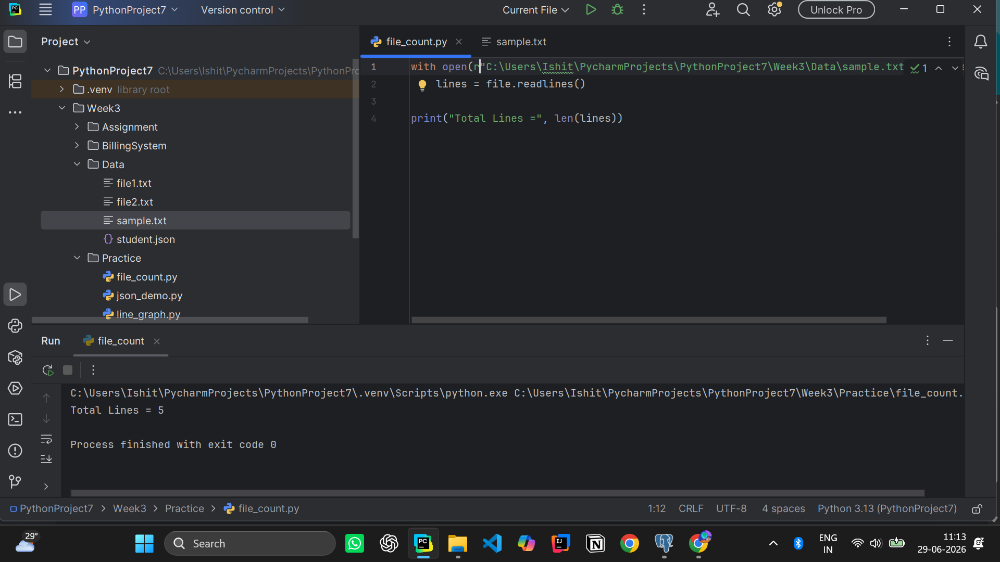
- Merge text files
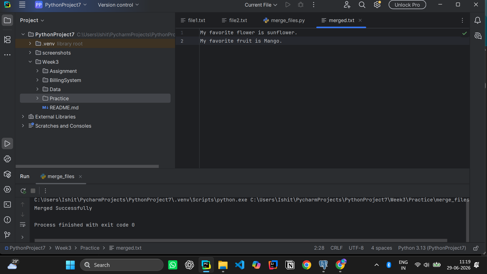
- CSV handling using Pandas
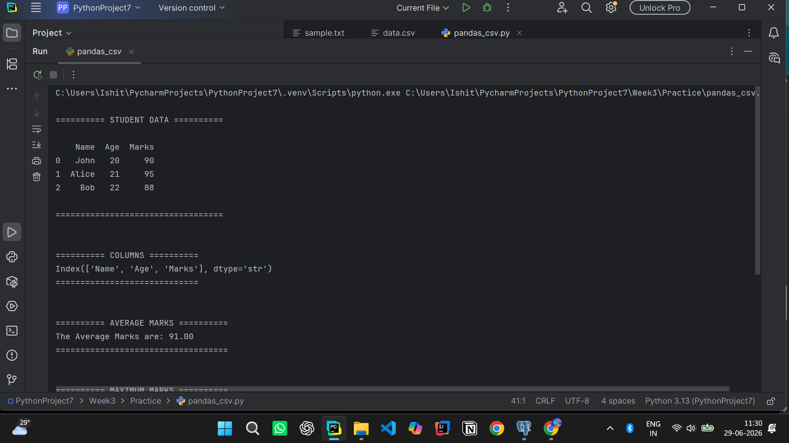
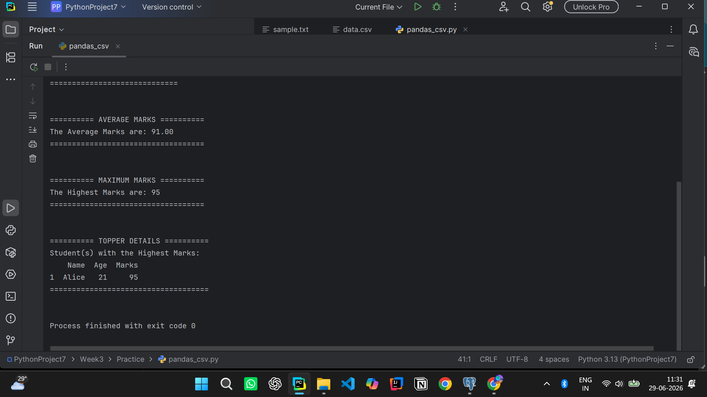
- Line graph using Matplotlib
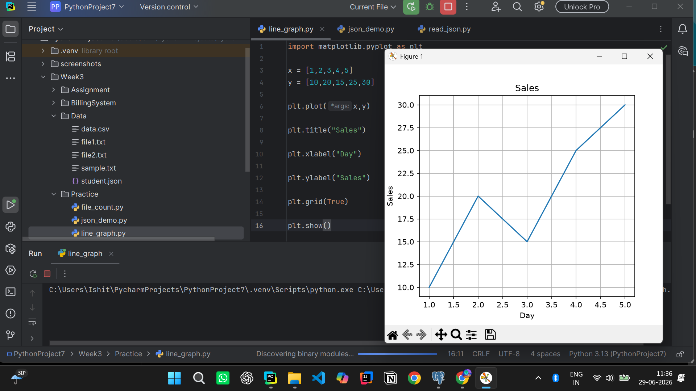
- JSON read/write
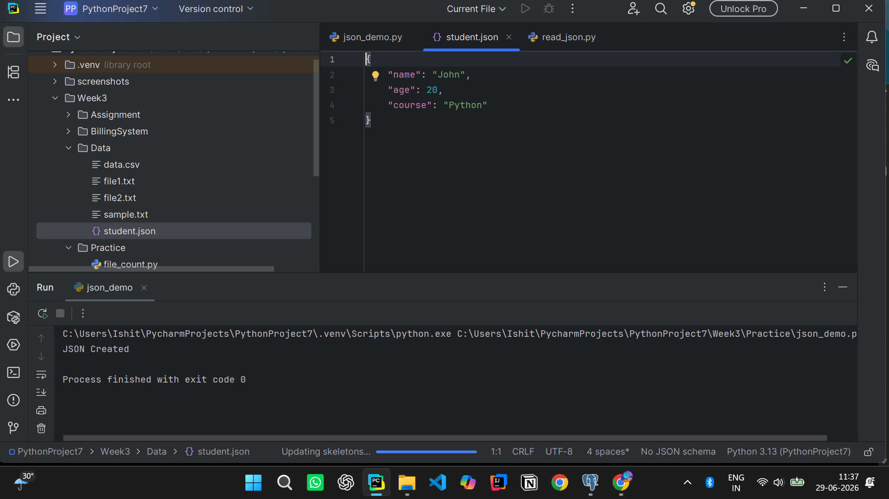
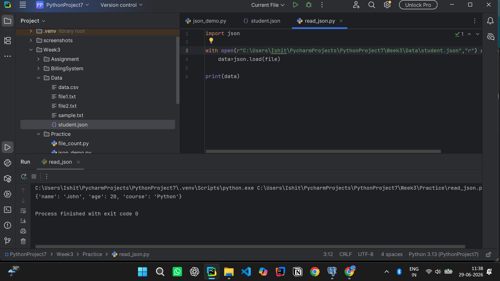

### Assignments
- Bank Account System
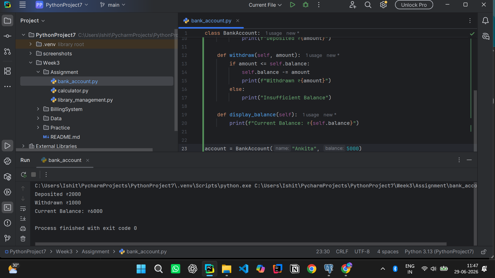
- Library Management System
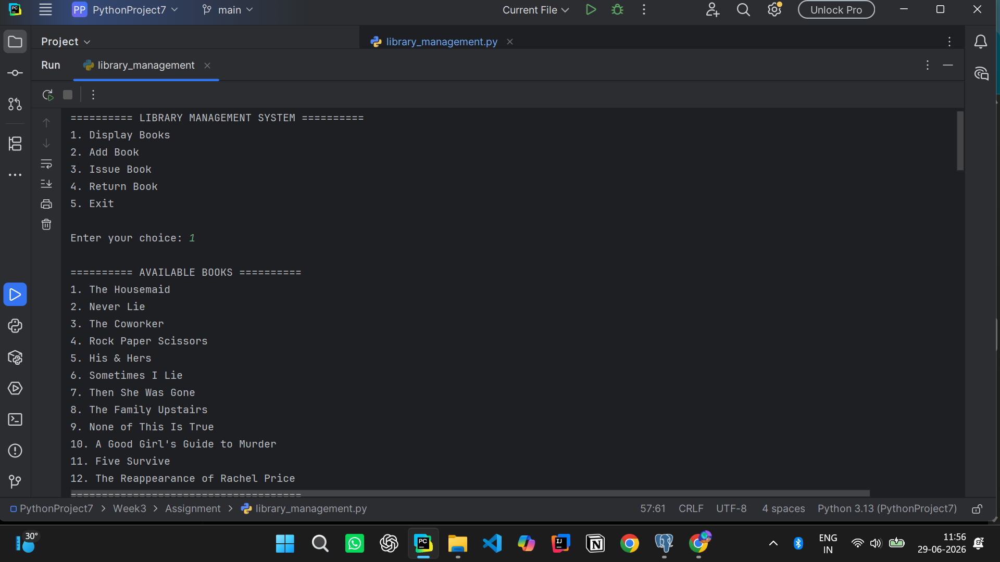
- Calculator with Exception Handling
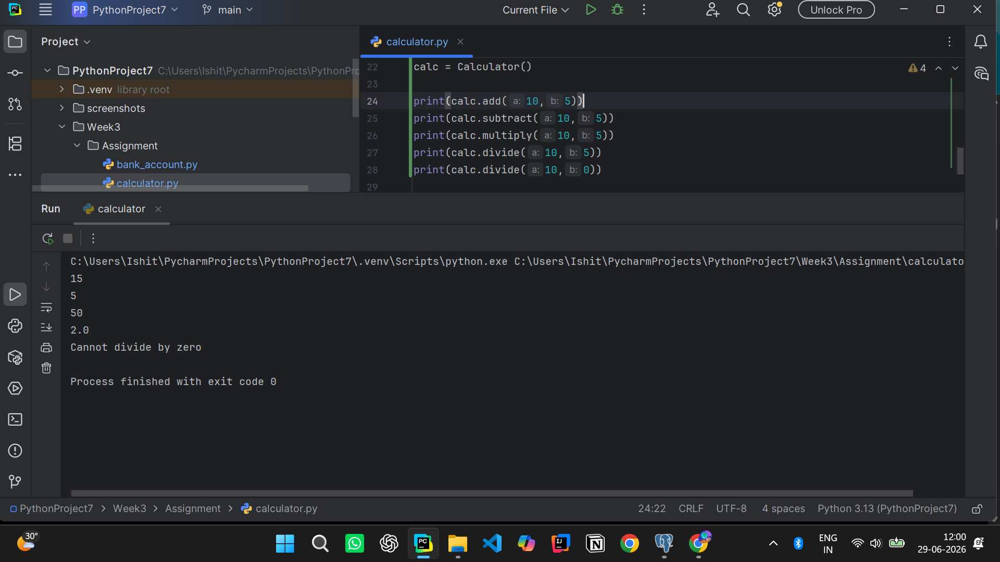

### Mini Project
- Billing System using Object-Oriented Programming
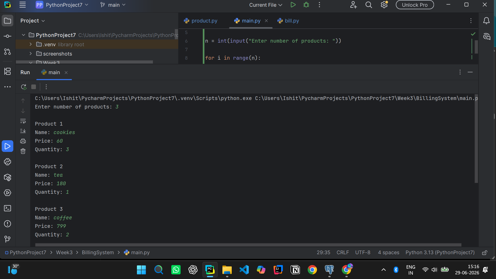
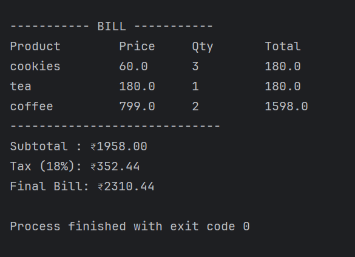
## Tools Used

- Python 3
- PyCharm
- Git
- GitHub
- Pandas
- Matplotlib

## How to Run

1. Clone this repository.
2. Open the project in PyCharm.
3. Install the required libraries:

```bash
pip install -r requirements.txt
```

or

```bash
pip install pandas matplotlib
```

4. Run any Python file from the project.

## What I Learned

- Writing programs using classes and objects
- Reading and writing files
- Handling exceptions
- Working with CSV and JSON files
- Creating simple graphs using Matplotlib
- Organizing Python projects using multiple files
- Using Git and GitHub for version control

---

**Python Programming Internship – Week 3**